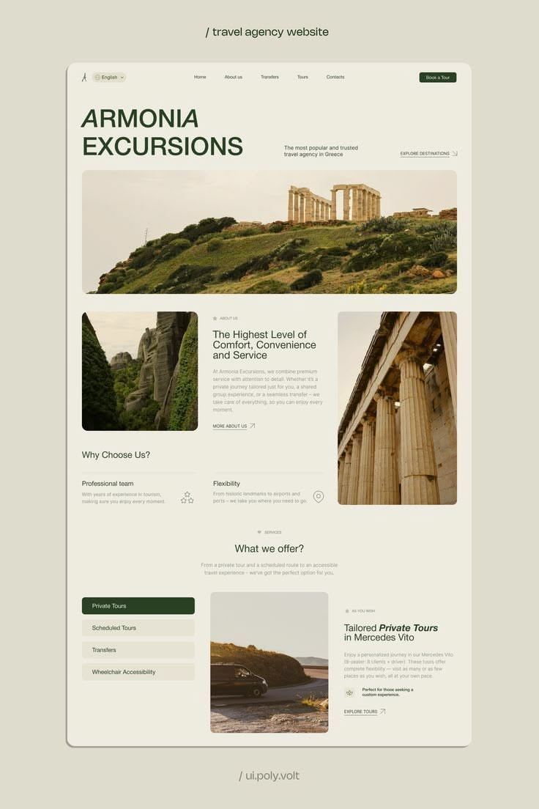
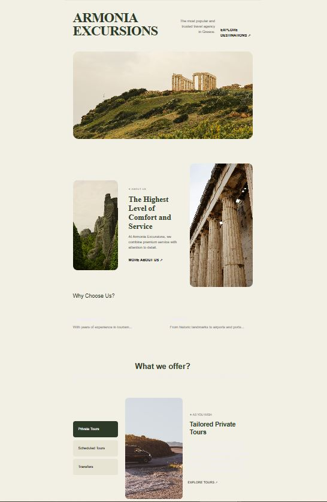

# LandPage_Reflex
### Aquí esta el landing page que realice basado en el de la imagen de pinterest que utilice como referencia.
---

## Diseño de Referencia

El diseño de la interfaz de usuario está inspirado y fielmente replicado a partir de la siguiente maqueta de diseño UI/UX:

* **Fuente:** [Pinterest: Armonia Excursions](https://es.pinterest.com/pin/629167010491145002/)
* **Maqueta de referencia: Página de Armonia Excursions**

 

---
## Diseño del landing page realizado por mi:
Así me quedo el diseño de mi landing page:

 

---

## ¿Qué características tiene el proyecto?

La página web cuenta con una estructura limpia, espaciada y elegante que incluye:
* **Navbar Estilizado:** Una barra de navegación superior minimalista y unificada con el fondo crema de la página, adaptada para escritorio y dispositivos móviles (menú hamburguesa).
* **Hero Section:** Presentación de impacto con tipografía serif elegante, descripción de la agencia y una gran imagen de portada con bordes suavizados.
* **Sección "About Us":** Distribución asimétrica en tres columnas (Imagen - Texto descriptivo - Imagen) que detalla el nivel de confort del servicio.
* **Grid de Beneficios:** Sección interactiva que destaca las ventajas de elegir la agencia (Equipo profesional y Flexibilidad).
* **Sección de Ofertas ("What we offer?"):** Panel con pestañas de servicios seleccionables (Private Tours, Scheduled Tours, Transfers) acompañado de imágenes y texto justificado.

---

## Tecnologías Utilizadas

* **Python:** Lenguaje base para el desarrollo.
* **Reflex Framework:** Framework de Python utilizado para compilar el Frontend (HTML/CSS/Next.js) y manejar el Backend en un solo entorno de código.
* **Poetry:** Gestor de dependencias y entornos virtuales aislado y moderno.
* **Node.js:** Motor de ejecución utilizado en segundo plano por Reflex para compilar la aplicación web.

---

## ¿Cómo abrir y correr el proyecto?

Sigue estos pasos en tu terminal para clonar el repositorio y ejecutar la aplicación de forma local en tu computadora:

### Prerrequisitos
Antes de empezar, asegúrate de tener instalado **Python** y **Node.js** en tu sistema operativo.

### 1. Clonar el repositorio
Abre tu terminal o Git Bash y clona este proyecto:
```bash
git clone <URL_DE_TU_REPOSITORIO>
cd LandPage_Reflex
2. Instalar dependencias con Poetry
Este proyecto utiliza Poetry para manejar las librerías de forma aislada. Para instalar Reflex y todos los componentes necesarios sin ensuciar tu entorno global, ejecuta:

Bash
poetry install
3. Ejecutar la aplicación
Para levantar el servidor de desarrollo, compilar el frontend y abrir la página web, utiliza el siguiente comando:

Bash
poetry run reflex run
Una vez que termine la compilación inicial, la terminal te indicará que la web está lista. Abre tu navegador e ingresa a:
http://localhost:3000 (Frontend de la aplicación)

